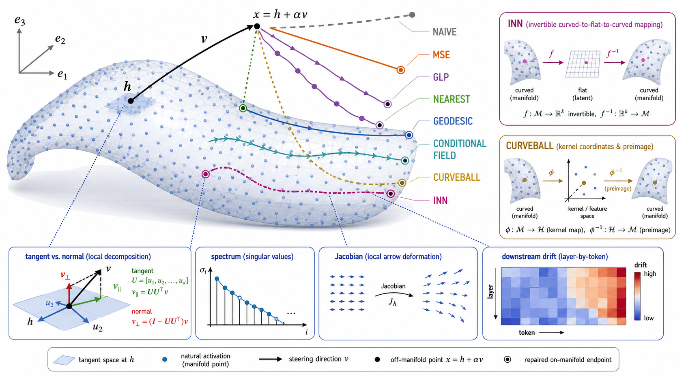

# Mechanistic Interpretability — дешёвый стиринг без деградации

## Задание

### О чём это

Интерпретируемость даёт возможность управлять вычислениями в языковых моделях.
Самый многообещающий способ на данный момент — **steering**. Пусть найдено
направление $v \in \mathbb{R}^d$ (например, столбец декодера SAE), отвечающее за
свойство модели, которое мы хотим усилить. Тогда мы делаем интервенцию

$$\tilde{h} = h + \alpha v,$$

где $h \in \mathbb{R}^d$ — скрытое состояние модели, $\alpha \in \mathbb{R}_{+}$ —
сила применения вектора. Обычно для появления эффекта нужны достаточно большие
$\alpha$, превосходящие норму исходного $h$. Из-за этого модель часто ломается
(растёт перплексия).

Демо: <https://huggingface.co/spaces/dlouapre/eiffel-tower-llama>

### Задача

Изучить, как уменьшить негативный эффект стиринга.

**Как измерять негативный эффект.** Две оси: по $x$ — что-то связанное с качеством
текста (fluency score, perplexity), по $y$ — насколько нужное свойство присутствует
в сгенерированных текстах. Изменяя $\alpha$, получаем парето-фронт в этих осях.
Чем сильнее свойство, тем хуже связность; хотим, чтобы кривая лежала как можно
ближе к правому верхнему углу.

**Как можно улучшить.** В недавней работе GLP [1] предлагается обучить flow
matching для активаций, чтобы затем аккуратно «расшумлять» их после стиринга.
Однако это долго обучать и очень дорого для инференса. Предлагается обучить
простую модель

$$\hat{h} = \operatorname{denoiser}(h + \varepsilon), \qquad \varepsilon \sim \mathcal{N}(0, \sigma^2 I),$$

$$\mathcal{L} = \lVert h - \hat{h} \rVert_2^2,$$

после чего во время инференса делать

$$\tilde{h} = \operatorname{denoiser}(h + \alpha v).$$

Для простоты фиксируем, что интервенции проводятся после срединного слоя LM
(например, после слоя 6 для GPT-2, у которой 12 слоёв).

Обязательно подумать про детали реализации:

- Как лучше зашумлять $h$? Помимо $h + \varepsilon$ можно подумать о
  $t \cdot h + (1 - t) \cdot \varepsilon$, $t \sim \mathcal{U}[0; 1]$.
- Какая архитектура должна быть у денойзера.
- Как можно исправлять ошибки стиринга — возможно, есть что-то хитрее, чем просто
  $\operatorname{denoiser}(h + \alpha v)$.
- Можно ли просто дообучить на такой лосс уже существующие в модели MLP, чтобы не
  менять структуру модели.
- Любая другая идея, как улучшить стиринг для LM.

Выше приведён лишь пример того, что можно сделать. Если есть другие идеи или они
придут во время выполнения задания — обязательно отразить это в отчёте и
попробовать свой метод.

### План действий

1. Выбрать небольшую LM и векторы $v$, на которых будет валидация (в минимальном
   варианте — GPT-2 и SAE к ней [2]).
2. Придумать, как измерять fluency/concept score. В идеале взять пайплайн из
   persona vectors, но он требует API до ChatGPT. Обратить внимание на
   dist-1, dist-2, dist-3 — их посчитать проще всего, и они что-то говорят о fluency.
3. Провалидировать векторы в простом сетапе стиринга $\tilde{h} = h + \alpha v$;
   убедиться, что получается похожая картинка с примером.
4. Обучить свою модель. **Важно: она не должна знать про существование каких-то $v$
   из валидации.**
5. Только после этого сравнивать обученную модель с обычным стирингом.
6. Написать отчёт о проделанной работе.

### Оформление решения

Код и отчёт (TeX или markdown) — в репозитории на GitHub, лучший адаптер или
чекпойнт — в открытый репозиторий на Hugging Face.

### Критерии

Важно не просто закинуть в GPT эту страницу и посмотреть на отчёт в конце: сильно
поощряются идеи интереснее описанных выше и демонстрация того, что они работают
лучше. Кроме того, не стоит забывать про анализ метода: метод, который хорошо
работает, — это лишь половина статьи, вторая половина — показать, **почему** и
**как** он работает.

### Полезные репозитории и ссылки

- <https://github.com/TransformerLensOrg/TransformerLens>
- <https://github.com/decoderesearch/SAELens>
- <https://github.com/safety-research/persona_vectors>

### Ссылки

[1] Luo, Feng, Darrell, Radford, Steinhardt. *Learning a Generative Meta-Model of
LLM Activations* (GLP). <https://generative-latent-prior.github.io/>
[2] <https://github.com/openai/sparse_autoencoder>

---

## Зафиксированный протокол

| поле | решение |
|---|---|
| LM и точка вмешательства | GPT-2, `blocks.6.hook_resid_post`, \(d=768\) |
| данные денойзеров | FineWeb, context до 1024, все non-BOS позиции; 98/2 train/validation по hash документа; validation directions при обучении не используются |
| масштаб обучения | Mac: до 100k train activations, короткая проверка динамики и диагностики; текущий full-body preliminary использует 100k train и 2k validation. A100: 100M activations, один проход; это reduced-scale проверка, а не буквальные 1B GLP |
| optimizer | AdamW, batch 4096 на A100, learning rate \(5\cdot10^{-5}\), cosine decay, warmup 1%; Mac batch выбирается по памяти без изменения effective batch |
| checkpoints | validation objective на фиксированном наборе каждые 1000 updates; сохраняются best и final; final methods повторяются с seeds 0/1/2 |
| основная direction | positive-sentiment DiffMean по SST-5 train: усреднить non-BOS states внутри каждого текста, затем взять разность class means; contrast data, prompts и generations не пересекаются |
| дополнительная проверка | OpenAI GPT-2 SAE directions только после отдельной проверки decoded effect; SAE encoder activation не считается property score |
| prompts | первые 100 строк авторского DExperts `neutral_prompts.jsonl` в исходном порядке, сохранены в [файле](datasets/dexperts_neutral_prompts_100.jsonl) и одинаковы для всех методов |
| intervention scope | только новые response tokens; prompt, BOS и другие special tokens не меняются |
| generation | 20 новых токенов, temperature 1.0, top-k 50; Mac: seed 0 и 1 continuation/prompt; A100: seeds 0/1/2 и 5 continuations/prompt |
| steering strength | \(\alpha=r\,\overline{\lVert h\rVert_2}\), средняя норма считается один раз по всему denoiser validation split; \(r\in\{0,0.2,0.4,0.6,0.8,1.0,1.2,1.4,1.6,1.8,2.0\}\) |
| generative repair | GLP, Consistency и MeanFlow: Mac sweep \(t_{start}\in\{0.2,0.35,0.5\}\); Rectified Flow: \(t_{start}=0.2\) и 1/2/4 шага. Выбор по validation prompts фиксируется до A100 evaluation |
| property | mean positive probability локального SST-2 classifier по continuation; полный score distribution сохраняется |
| quality | conditional continuation NLL и perplexity под чистой GPT-2; dist-1/2/3 остаются дополнительной diversity-диагностикой |
| uncertainty | 95% bootstrap interval по prompt, 1000 resamples; одинаковые prompt/seed pairs между методами |
| порядок | validation direction и naive steering; MSE и GLP; ускорения; geometry; conditional methods; общий Pareto |
| локальный запуск | MPS, тот же код и настоящая архитектура, подмножество train documents, максимум 30 минут; сравниваем сходимость, устойчивость и реальные траектории, но не финальное качество метода |
| полный запуск | A100, полный train split; screening одним seed, финал тремя seeds |
| общий Mac-report | один зафиксированный PCA basis, fit на clean FineWeb validation activations; все методы, alpha и trajectories преобразуются только через него |
| geometry screen | 20k natural non-BOS activations; для каждой точки 256 соседей и local SVD rank 16; показываются весь singular spectrum, kNN distance, local-PCA residual, tangent/normal displacement и correction energy capacity-MSE |
| noise tolerance | isotropic Gaussian масштабируется так, чтобы ожидаемая норма perturbation была \(r\,\overline{\lVert h\rVert_2}\); используется тот же \(r\)-grid и seed 0 |

## Общая архитектура денойзеров

Все unconditional denoisers получают одну стандартизованную активацию \(z\in\mathbb{R}^{768}\), поэтому attention не нужен. Simple MSE из задания использует один residual block `RMSNorm → Linear(768,3072) → GELU → Linear(3072,768)`. GLP и capacity-matched MSE используют `Linear(768,1536)`, четыре residual SwiGLU-блока с RMSNorm и hidden size 3072, затем `RMSNorm` и `Linear(1536,768)`. Additive MSE без времени получает только \(z\). Flow/interpolation методы получают sinusoidal embeddings нужных времён через multiplicative modulation каждого SwiGLU gate.

Первый Mac wiring-run уменьшает общий GLP-backbone до width 768, двух SwiGLU-блоков и hidden size 1536. Full-body Mac preliminary и A100 используют width 1536, четыре блока и hidden size 3072. Additive capacity control меняет только timestep path, поэтому совпадает с GLP по основным блокам, но не по общему числу параметров conditioning.

Для conditional field cross-attention избыточен: условие одно и не образует последовательность. Frozen text encoder даёт pooled vector \(e(c)\); MLP из \(e(c)\) и timestep embedding предсказывает \(\gamma,\beta\), а каждый SwiGLU-блок применяет FiLM к gate:

$$g'=(1+\gamma)\odot g+\beta.$$

Tangent-preserving MSE использует тот же reduced capacity backbone без времени. Для каждой clean activation локальный SVD basis считается по bank 20k с (k=256), rank 16; normal noise удаляется, а tangent noise остаётся в target.

Curveball fit выполняется на 256 SST-5 активациях каждого класса: polynomial KPCA degree 2, (gamma=0.001), 20 coordinates, Nadaraya–Watson preimage с median bandwidth и возвратом residual. INNSteer использует четыре RealNVP coupling-блока с hidden 256, bounded scale (0.75\tanh(s)), alternating split и ActNorm; objective содержит Gaussian NLL, class-mean separation и mean/variance log-determinant penalty. Для общего alpha-протокола величина сдвига Curveball и INNSteer подбирается bisection так, чтобы средняя норма изменения в исходном 768D-пространстве совпала с (alpha).

Reduced UniSteer использует width 768, два SwiGLU-блока и hidden 1536. Frozen SST-2 DistilBERT кодирует positive, negative и null conditions; source activation инвертируется под null condition и переносится к positive condition за 10+10 Euler steps. Его собственная edit strength ограничена ([0,1]); bisection выбирает ближайшую достижимую full-space норму.

## Конструктор методов

| деталь | варианты |
|---|---|
| что предсказывает сеть | clean endpoint; instantaneous velocity; average velocity |
| что получает сеть | activation; time; interval; pooled concept condition |
| где происходит edit | исходное пространство; local tangent space; kernel coordinates; invertible coordinates |
| сколько вызовов | 1; 2–4; 20 |

## Эксперименты

| № | метод | что именно учим и делаем | код | статус | данные | предварительный Mac | итоговый A100 | HTML |
|---|---|---|---|---|---|---|---|---|
| 1 | Validation direction | Проверить decoded property effect на полном alpha sweep до обучения repair; encoder и decoder стороны SAE проверяются раздельно | [baseline](baseline.py) | Mac завершён | [общий sweep](runs/mac_screening/screening.json), [SAE pilot](logs/check_sae27677.json) | DiffMean: property 0.479→1.000; два SAE-вектора pilot не подтвердил | — | [HTML](runs/mac_screening/screening.html) |
| 2 | Noise tolerance | \(x=h+\sigma\epsilon\); найти, когда random noise меняет NLL, generation и downstream state | [screen](tmp/screening.py) | Mac завершён | общий протокол, полный \(r\)-grid | NLL 2.778→6.435; property 0.479→0.286 | — | [HTML](runs/mac_screening/screening.html) |
| 3 | Naive | \(R(x)=x,\ x=h+\alpha v\); общая точка отсчёта | [screen](tmp/screening.py) | Mac завершён | общий протокол, полный \(r\)-grid | NLL 2.778→6.582; property 0.479→1.000 | — | [HTML](runs/mac_screening/screening.html) |
| 4 | Additive MSE | Fixed-noise regression \(D(h+\sigma\epsilon)\to h\); отдельно simple MLP и capacity-matched GLP body, оба без timestep | [model](tmp/methods.py), [train](tmp/training.py), [run](tmp/run_mac_baselines.py) | Mac завершён | FineWeb 100k/2k, 2000 updates, MPS; общий протокол | \(r=0.4\): simple 3.436/0.789; capacity 3.704/0.822 NLL/property | — | [HTML](runs/mac_screening/screening.html) |
| 5 | Interpolation MSE | \(z_t=(1-t)h+t\epsilon\); сеть получает \(z_t,t\) и предсказывает \(h\) за один вызов | [model](tmp/methods.py), [train](tmp/training.py) | Mac завершён | FineWeb 100k/2k, 2000 updates, MPS; общий протокол | \(r=0.4\): NLL 3.357; property 0.821 | — | [HTML](runs/mac_screening/screening.html) |
| 6 | [GLP](https://arxiv.org/abs/2602.06964) + SDEdit | \(u_\theta(z_t,t)\approx\epsilon-h\); steered state частично зашумляется, затем 20 Euler-шагов к \(t=0\) | [model](tmp/methods.py), [train](tmp/training.py) | Mac завершён | FineWeb 100k/2k, 2000 updates, MPS; \(t_{start}=0.2/0.35/0.5\) | \(t=0.2,r=0.4\): 3.306/0.829; \(t=0.35,r=0.4\): 4.049/0.937 NLL/property; \(t=0.5\) не вошёл в Pareto | — | [HTML](runs/mac_screening/screening.html) |
| 7 | One-Euler GLP | Один большой шаг \(z_0\approx z_t-t\,u_\theta(z_t,t)\); без нового обучения, контроль ошибки интегратора | [model](tmp/methods.py), [screen](tmp/screening.py) | Mac завершён | GLP checkpoint; общий протокол | \(r=0.4\): NLL 3.314; property 0.809; 1.3 ms | — | [HTML](runs/mac_screening/screening.html) |
| 8 | [Consistency model](https://arxiv.org/abs/2303.01469) | Endpoint network \(f_\theta(z_t,t)\to z_0\); точки одной EMA trajectory дают одинаковый endpoint, \(f(z_0,0)=z_0\) задаётся skip connection | [model](tmp/methods.py), [run](tmp/run_mac_speedups.py) | Mac завершён | FineWeb 20k/1k, 300 updates, CPU; \(t_{start}=0.2/0.35/0.5\) | Лучший \(t=0.2,r=0.4\): NLL 3.356; property 0.810; 0.3 ms | — | [HTML](runs/mac_screening/screening.html) |
| 9 | [Rectified Flow](https://arxiv.org/abs/2209.03003) | 20-step GLP создаёт noise/endpoint pairs; новое velocity field выпрямляет эти paths; inference сравнивается при 1/2/4 шагах | [model](tmp/methods.py), [pairs/train](tmp/training.py), [run](tmp/run_mac_speedups.py) | Mac завершён | FineWeb 20k/1k; 512/128 teacher pairs; 300 updates; общий протокол | \(r=0.6\), 1 step: NLL 4.022; property 0.931; 2/4 шага улучшения не дали | — | [HTML](runs/mac_screening/screening.html) |
| 10 | [MeanFlow](https://arxiv.org/abs/2505.13447) | \(u_\theta(z_t,r,t)\) предсказывает average velocity на \([r,t]\), то есть displacement за один шаг; objective использует JVP \((v,0,1)\) и stop-gradient target | [model](tmp/methods.py), [run](tmp/run_mac_speedups.py) | Mac завершён | FineWeb 20k/1k, 300 updates, CPU; \(t_{start}=0.2/0.35/0.5\) | Лучший \(t=0.2,r=0.4\): NLL 3.337; property 0.820; 0.8 ms | — | [HTML](runs/mac_screening/screening.html) |
| 11 | Nearest activation | Без обучения заменить \(x\) ближайшей real non-BOS activation | [geometry](tmp/methods.py), [screen](tmp/screening.py) | Mac завершён | bank 20k; общий протокол | Уже при \(r=0\): NLL 5.107; property 0.493 | — | [HTML](runs/mac_screening/screening.html) |
| 12 | Segment-kNN | Среди real activations с проекцией на \([h,h+\alpha v]\) выбрать точку с минимальной perpendicular distance | [geometry](tmp/methods.py), [screen](tmp/screening.py) | Mac завершён | bank 20k; общий протокол | \(r\ge0.2\): NLL около 5.282; property около 0.556 | — | [HTML](runs/mac_screening/screening.html) |
| 13 | Tangent/normal ablation | Для local SVD basis \(U(h)\): \(v_T=UU^Tv,\ v_N=(I-UU^T)v\); сравнить full, tangent и normal steering | [geometry](tmp/methods.py), [screen](tmp/screening.py) | Mac завершён | bank 20k, \(k=256\), rank 16; общий протокол | \(r=0.4\): tangent 3.245/0.736; normal 3.246/0.793 | — | [HTML](runs/mac_screening/screening.html) |
| 14 | Tangent-preserving MSE | \(\tau=UU^T\epsilon_1,\ \nu=(I-UU^T)\epsilon_2\); учить \(D(h+\tau+\nu)\to h+\tau\) | [model](tmp/methods.py), [train](tmp/run_mac_tangent.py) | Mac завершён | FineWeb 2k/256, bank 20k, \(k=256\), rank 16, 300 updates | \(r=0.4\): NLL 3.454; property 0.848 | — | [HTML](runs/mac_screening/screening.html) |
| 15 | Safe correction | Для \(c=D(x)-x\) использовать \(c_{safe}=c-\langle c,\hat v\rangle\hat v\), чтобы repair не стирал steering coordinate | [screen](tmp/screening.py) | Mac завершён | capacity MSE; общий протокол | \(r=0.4\): NLL 4.384; property 0.916 | — | [HTML](runs/mac_screening/screening.html) |
| 16 | Local geodesic | \(h_{k+1}=h_k+\delta P_{T_{h_k}}v\); после шага пересчитать kNN и local SVD basis | [geometry](tmp/methods.py), [screen](tmp/screening.py) | Mac завершён | bank 20k, 8 шагов, \(k=256\), rank 16; общий протокол | \(r=0.4\): NLL 3.228; property 0.781; 95.5 ms | — | [HTML](runs/mac_screening/screening.html) |
| 17 | Curveball | Polynomial KPCA \(\phi(h)\), linear class-mean shift в kernel coordinates, kernel-weighted preimage и возврат residual | [fit](tmp/run_mac_curveball.py), [map](tmp/nonlinear.py) | Mac завершён | SST-5 train, 256/class, 20 kernel coordinates | Лучшее property 0.546 при \(r=0.2\); дальше около 0.50 | — | [HTML](runs/mac_screening/screening.html) |
| 18 | Conditional field / UniSteer | Учить \(u_\theta(z_t,t,c)\); pooled frozen condition embedding и timestep управляют SwiGLU через FiLM | [model](tmp/nonlinear.py), [train](tmp/run_mac_unisteer.py) | Mac завершён | SST-5 train, 1792/class, 300 updates | После \(r=0.2\) выход насыщается: NLL 2.870; property 0.460; около 230 ms | — | [HTML](runs/mac_screening/screening.html) |
| 19 | INNSteer | RealNVP affine coupling blocks \(\phi\) задают обратимые coordinates; linear shift в них после \(\phi^{-1}\) становится nonlinear и input-dependent | [model](tmp/nonlinear.py), [train](tmp/run_mac_inn.py) | Mac завершён | SST-5 train, 2048 pairs, 300 updates | \(r=2.0\): NLL 5.068; property 0.742; 4.9 ms | — | [HTML](runs/mac_screening/screening.html) |
| 20 | Финальное сравнение | Все прошедшие screening методы на одном протоколе: latency, Pareto, trajectories и failure cases | [screen](tmp/screening.py) | Mac завершён | [308 точек](runs/mac_screening/screening.json), [основной log](logs/mac_screening.log), [nonlinear log](logs/mac_screening_nonlinear.log), [t-start log](logs/mac_screening_tstart.log) | 28 вариантов × 11 значений \(r\); предварительный Pareto и диагностика собраны | — | [HTML](runs/mac_screening/screening.html) |
| 21 | Paired evaluator integrity | На текущей Git revision повторить identity control и сравнить методы на одинаковых random draws; при \(r=0\) identity methods должны дать побитово одинаковые continuations | [diagnostic](tmp/run_mac_geometry_diagnostic.py) | Mac завершён | первые 16 фиксированных prompts, seed 0, \(r=0/0.4/0.8\) | Naive, INNSteer и UniSteer при \(r=0\): 16/16 одинаковых continuations; прежнее расхождение вызвано повторным использованием mixed-revision JSON | — | [HTML](runs/mac_geometry_diagnostic/screening.html) |
| 22 | Real-token geometry | На токенах тех же continuations сохранить вход и выход intervention; измерить steering projection, orthogonal displacement, kNN distance и local residual вместе с decoded outcome | — | Запланирован | тот же paired diagnostic | held-out geometry собрана, response-token trace ещё не сохранён | — | — |
| 23 | Correction fraction ablation | Для Naive→repair path проверить доли correction \(\lambda=0/0.25/0.5/0.75/1\) при \(r=0.4/0.8\); улучшением считается снижение NLL при сохранении property | — | — | — | — | — | — |
| 24 | Nonlinear calibration controls | Сопоставить запрошенную и достигнутую норму edit; отдельно проверить Curveball monotonicity, INNSteer identity/inverse и максимальный endpoint UniSteer | [diagnostic](tmp/run_mac_geometry_diagnostic.py) | Mac завершён на held-out | 8 held-out activations | Curveball и INNSteer тратят основную норму вне DiffMean; UniSteer достигает только 4.3 нормы и насыщается уже на первом ненулевом \(r\) | — | [HTML](runs/mac_geometry_diagnostic/screening.html) |
| 25 | Fine-alpha matched-property gate | До насыщения classifier сравнить NLL при близком property на \(r=0/0.1/0.2/0.3/0.4/0.6/0.8\); гипотеза: полезный repair сохраняет большую часть DiffMean-сдвига и добавляет меньшую устойчивую correction | [diagnostic](tmp/run_mac_geometry_fine.py) | Mac запланирован | первые 16 фиксированных prompts, seed 0; nonlinear-прототипы и local geodesic исключены после row 21/24 | — | — | [HTML](runs/mac_geometry_fine/screening.html) |

## Диагностика

Картинка объясняет координаты, но не является результатом. [Общий HTML](runs/mac_screening/screening.html) строится по реальным held-out активациям и объединяет:

- clean, steered и repaired activation, direction и correction;
- denoiser input, output, residual и промежуточные flow states;
- одну сохранённую held-out проекцию для всех methods и checkpoints, рядом с full-dimensional distances;
- train/validation loss, learning rate, gradient norm и checkpoint progression;
- local neighbours, tangent/normal split и singular spectrum только в geometry experiments;
- Jacobian spectrum только при проверке local contraction или amplification;
- gradients только при проверке alignment конкретного path с quality/property objective;
- downstream drift, logits и decoded generations на фиксированных prompts;
- causal alpha sweep с naive, repair и отключением отдельных correction components;
- Pareto, latency, memory и разобранные failure cases со ссылками на JSON, log и checkpoint.

Проверяемые geometry-гипотезы:

- random noise должен сначала увеличивать kNN distance, local-PCA residual и correction energy, а затем NLL; отсутствие такого порядка опровергает эти величины как раннюю диагностику;
- tangent/normal split должен отделить property effect от quality damage; если Pareto full, tangent и normal совпадает, локальная линейная геометрия здесь ничего не объясняет;
- nearest, Segment-kNN и local geodesic должны уменьшать full-dimensional geometry deviations при сохранении property; уменьшение только проекции PCA не считается;
- safe correction должен сохранять steering coordinate лучше обычного repair при сопоставимой geometry; рост property ценой прежнего NLL не считается улучшением;
- Curveball, UniSteer и INNSteer проверяются в собственных координатах, но сравниваются только по общим decoded Pareto и geometry axes.
