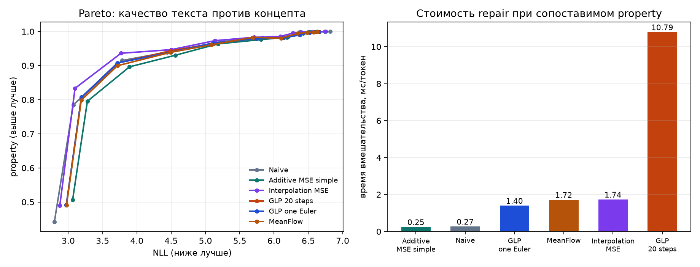

# Дешёвый стиринг GPT-2 без деградации текста

Лучший чекпойнт: **https://huggingface.co/vladotpad/gpt2-one-euler-steering-denoiser**
Интерактивная диагностика: [screening.html](screening.html)

Для начала объяснюсь: из мощностей у меня был MacBook Pro на M1 Max, и этого хватило. Модель здесь GPT-2 small, обучается не она, а маленький денойзер поверх её активаций, всё прошло на MPS.

## Сетап

Вмешательство поставил после шестого блока, в остаточный поток. Для активации $h\in\mathbb{R}^{768}$ линейный сдвиг имеет вид

$$
h_{\text{steered}}=h+\alpha v,
$$

где $v$ — направление свойства, которое нужно усилить.

Рост $\alpha$ усиливает это свойство и одновременно уводит активацию с распределения естественных состояний, поэтому сравнивать нужно весь компромисс между свойством и качеством. Тексты генерировал от фиксированных затравок, а специальные токены так и не трогал. Сдвиг при этом шёл только на новые токены продолжения.

Два направления декодера разреженного автокодировщика в самом тексте ожидаемого эффекта не дали: читающая и записывающая стороны этих признаков описывали разное. Поэтому в основном эксперименте я взял разность средних по положительной тональности на SST-5. Это не столбец автокодировщика, и я это фиксирую явно.

Естественные активации собрал на FineWeb, чтобы денойзер обучался на обычном тексте, а не на отзывах, по которым строилось направление. Обучающую и проверочную части разделил по хешу документа, а начальный токен ещё и исключил: его активации не зависят от сгенерированного продолжения. Отдельно держу проверочное направление тональности: в обучение денойзера оно не входит, иначе то же направление, которым потом сдвигаю, попало бы в обучение.

Генерации считал на одном наборе затравок DExperts, одних настройках сэмплирования, одних сидах и полном проходе по $\alpha$, чтобы разница методов не смешивалась с разницей затравок. Качество — среднее отрицательное логарифмическое правдоподобие продолжения под чистой GPT-2, перплексия его экспонента. Эта величина не содержит доли уникальных n-грамм и на повтор одной фразы не реагирует, поэтому отдельно считаю доли уникальных униграмм, биграмм и триграмм. Свойство — вероятность положительной тональности по классификатору SST-2. Скорость — время коррекции активации, без прямого прохода GPT-2. Точки с одинаковым $\alpha$ по достигнутому свойству не равны, поэтому сравниваю кривые свойство–качество, а не значения при фиксированном $\alpha$.

## Методы

Постановка такая: после линейного сдвига точка уходит с распределения естественных активаций, и я пытаюсь её вернуть. Мне хотелось разобраться, что вообще значит уйти с этого распределения, и уже отсюда перебирать варианты.

Первое, о чём я подумал: линейный сдвиг задаёт отрезок от $h$ до $h+\alpha v$, а многообразие в самом грубом виде есть просто облако обучающих активаций. Попробовал заменить сдвинутую точку ближайшей активацией из этого облака, либо той, в которой отрезок сдвига проходит ближе всего к реальному состоянию. Оба варианта без обучаемого денойзера.

Дальше моё представление было такое: манифолд — это многообразие, у него есть свойство вроде ранга, и выход за этот ранг уводит точку с естественного множества. Оказалось, что оно ещё и нелинейное. Тогда направление $v$ в каждой точке я решил разложить по локальному касательному базису. Базис $U(h)$ — первые $r$ правых сингулярных векторов по $k$ ближайшим естественным активациям. Касательная и нормальная составляющие

$$
v_\parallel=UU^\top v,\qquad v_\perp=v-v_\parallel.
$$

Касательный стиринг двигает только $v_\parallel$, нормальный только $v_\perp$. Гипотеза была такая: свойство меняется вдоль касательной, качество портится вдоль нормали.

Получается, что на кривом множестве глобальное $v$ быстро перестаёт быть касательным. Один прыжок $h+\alpha v$ выводит точку с поверхности, так что тот же сдвиг я прошёл мелкими шагами и после каждого пересчитывал базис:

$$
h_{k+1}=h_k+\frac{\alpha}{K}\widehat{P_{T_{h_k}}v},\qquad k=0,\ldots,K-1.
$$

Это геодезический вариант: восемь шагов, базис из 256 соседей, ранг 16. $P_{T_{h_k}}=U(h_k)U(h_k)^\top$, направление после проекции я нормировал.

Геометрические подходы ничего не учат: они двигают точку по уже собранному облаку. Поэтому дальше я перешёл к денойзингу. Сети я подавал $h+\varepsilon$, и она восстанавливала $h$. Чтобы размер не смешивался с задачей, одну сеть взял узким MLP, другую шире и глубже. Это я назвал "аддитивным денойзером".

Денойзер при возврате может убрать сам сдвиг вместе с искажением. Если сеть выдаёт $D(x)$ для уже сдвинутой точки $x=h+\alpha v$, поправка это $c=D(x)-x$. Чтобы направление $v$ не вычиталось вместе с искажением, я решил из $c$ убирать проекцию на $v$:

$$
\tilde h=x+c-\frac{\langle c,v\rangle}{\|v\|^2}v.
$$

Этот вариант я проверил на аддитивном денойзере. Свойство выросло, правдоподобие упало сильнее обычного возврата в многообразие, так что в сравнение ниже я его не добавлял.

У аддитивного денойзера уровень шума я выбрал заранее и ничем не мотивировал, поэтому перешёл к интерполяции: беру $t\sim U[0,1]$ и учу по

$$
z_t=t\,h+(1-t)\varepsilon
$$

сразу предсказывать чистую активацию. Обучил на смесях с разным $t$, а $t$ на вход так и не подавал. На инференсе сеть вызывал один раз, на $h+\alpha v$.

Если уж искажение параметризовано временем, возвращать точку можно вдоль поля скоростей. В [GLP](https://generative-latent-prior.github.io/) сдвинутую активацию считают испорченным сэмплом и возвращают к данным по выученному полю. Сеть предсказывает $u_\theta(z,t)$, на инференсе активация частично зашумляется до $t_{\text{start}}$ и интегрируется двадцатью шагами Эйлера. Чем меньше $t_{\text{start}}$, тем меньший отрезок интегрируется и тем больше от сдвинутой активации остаётся. Более широкую сеть из пары выше я как раз взял совпадающей с телом GLP по ширине и глубине.

Оставалось непонятно, зачем для одной точки двадцать шагов, если речь не про генерацию изображения, а про возвращение активации на место. Тот же выученный $u_\theta$ я взял один раз и прошёл весь оставшийся отрезок:

$$
z\leftarrow z-t_{\text{start}}\,u_\theta(z,t_{\text{start}}).
$$

Среди одношаговых потоковых моделей нашёл MeanFlow: сеть сразу предсказывает среднюю скорость на отрезке, поэтому ей тоже хватает одного вызова.

А чтобы было от чего отсчитывать цену коррекции, наивный стиринг я оставил как есть: $h+\alpha v$ без правки.

Проводя разбор недавних нелинейных стирингов, нашёл ещё три готовых хода, которые двигают точку сразу вдоль многообразия, а не чинят её после линейного скачка. Curveball строит полиномиальные ядровые координаты, сдвигает в них разность классовых средних и возвращает точку взвешенным прообразом. UniSteer учит условное поле скоростей: замороженный кодировщик задаёт положительное, отрицательное и нулевое условие, и активация переносится между ними несколькими шагами. INNSteer строит обратимые координаты аффинными связывающими блоками, так что линейный сдвиг в $z$ после обратного отображения становится нелинейным и зависящим от входа:

$$
\tilde h=F^{-1}\bigl(F(h)+\alpha\,d\bigr).
$$

Геометрические и нелинейные варианты я прогнал предварительно на небольшой подвыборке.

Касательный, нормальный и геодезический ходы из теории не оправдались, почему - требуется дальнейший анализ. Гипотеза была: свойство меняется вдоль касательной, качество портится вдоль нормали. Сдвиг вдоль $v_\parallel$ и вдоль $v_\perp$ портит текст похоже, восемь шагов с пересчётом $U(h)$ не лучше прямого $h+\alpha v$. Гипотеза не подтвердилась. Механизма, почему касательная здесь не про свойство, нет.

А вот ближайшая активация, точка на отрезке, Curveball, UniSteer и INNSteer уже с диагностикой. Замена на соседа из облака портит правдоподобие даже без вмешательства: это другой токен, не починка текущего. У Curveball и INNSteer основная часть нормы правки уходит мимо направления тональности: они двигаются по многообразию, но не вдоль $v$. UniSteer на первом ненулевом $\alpha$ выходит на свою максимальную норму, дальше по кривой идти нечему. Поэтому на графике остались наивный сдвиг и обученные денойзеры. Точки остальных — в [screening.html](screening.html).

## Результаты

Интерактивная версия со всеми точками, тремя сидами, доверительными интервалами, реальными генерациями, геометрическими вариантами и нелинейными стирингами — в [screening.html](screening.html). Показанные продолжения текста — это полторы тысячи настоящих генераций, объединённых из трёх чекпойнтов. Обучаемые методы я усреднил по трём сидам, у каждого среднего 95-процентный интервал. У наивного стиринга сети нет, его один прогон, интервала нет.

На графике слева шесть методов: наивный сдвиг, аддитивный и интерполяционный денойзеры, GLP в двадцати шагах и в одном шаге Эйлера, MeanFlow. Все шесть шли почти по одной кривой. При сопоставимом усилении свойства правдоподобие различалось в третьем знаке, и разница между любыми двумя методами была меньше, чем шаг по силе вмешательства внутри одного метода. Интерполяционный денойзер шёл чуть выше остальных в средней части кривой, но этот отрыв пропал при более сильном вмешательстве.

| метод | NLL | свойство | мс на токен |
|---|---:|---:|---:|
| наивный сдвиг | 3.073 | 0.785 | 0.275 |
| аддитивный денойзер | 3.279 | 0.795 | 0.251 |
| интерполяционный денойзер | 3.099 | 0.833 | 1.739 |
| GLP, двадцать шагов | 3.190 | 0.806 | 10.795 |
| GLP, один шаг Эйлера | 3.192 | 0.807 | 1.405 |
| MeanFlow | 3.190 | 0.799 | 1.721 |

Зато правый график показывает стоимость. Двадцатишаговый GLP стоил на порядок дороже остальных, одношаговый вариант укладывался в 1.4 мс при том же качестве. MeanFlow и интерполяционный денойзер около 1.7 мс, аддитивный дешевле всех. Двадцать шагов интегрирования не дали измеримого выигрыша в качестве. Один шаг Эйлера по тому же полю дал ту же точку почти в восемь раз быстрее. Это как раз то упрощение, которое на этапе методов казалось слишком грубым.

## Разбор

Наивный сдвиг напрямую записывает направление тональности из SST-5, а оценивает результат классификатор, обученный на SST-2. Задача и домен у них общие, поэтому наивный вариант здесь и оказался заведомо сильным.

У безусловного денойзера нет признака, какая часть отклонения внесена намеренно, и он может убрать сам сдвиг вместе с повреждением. При одинаковой силе вмешательства аддитивный, интерполяционный, GLP и MeanFlow теряли в свойстве по сравнению с наивным: часть намеренного смещения убиралась вместе с шумом. Одношаговый Эйлер делает ровно один шаг к многообразию естественных активаций. Вернуть одну точку на многообразие проще, чем генерировать изображение, поэтому двадцать шагов приходили в ту же точку за большее время. При сильном $\alpha$ разница между ними пропадала. Активация уходила слишком далеко, и возврат либо снижал свойство, либо оставлял испорченный текст.

Плоская кривая из механики методов объясняется лишь отчасти. Метрики в этой области уж очень шумные. Измерить беглость текста и присутствие концепта трудно, хороших метрик нет, поэтому я взял отзывы на фильмы с разметкой тональности: тема понятная, и на ней классификатор ведёт себя устойчиво. Классификатор же близок к данным, на которых искалось направление, и может переоценивать простое повторение положительной лексики. Места для улучшения по выбранным метрикам поэтому мало, а если метод работает плохо, по этим числам это не видно. Неясно ещё, насколько активации, объявленные направлением концепта, к нему относятся, и относятся ли именно после шестого блока.
